# MYNDlights

Addressable LED mod with custom 3D-printed front panels for the [Teufel MYND](https://github.com/teufelaudio/mynd-hardware) open-source Bluetooth speaker. Runs WLED on an ESP32-S3 with audio-reactive effects driven by I2S bus sniffing.

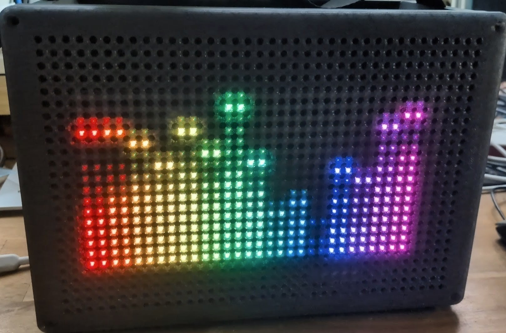

[Demo (YouTube)](https://youtube.com/shorts/J1kN-PWX2cs)

---

## How It Works

The ESP32-S3 operates as an **I2S slave**, passively sniffing the I2S data line between the MYND's Bluetooth module and its amplifier. This enables audio-reactive LED effects without any active signal interception or modification to the audio path.

WLED was recompiled with the generic I2S driver configured in slave mode to make this work.

A custom flex PCB taps the I2S connector on the mainboard — no soldering required (see [Installation](#installation)).

---

## Hardware

| Component | Details |
|-----------|---------|
| MCU | Seeed XIAO ESP32-S3 |
| LEDs | WS2812B (NeoPixel-compatible) |
| Wiring | FFC cables (6-wire flex for LED power + data) |
| Interface | Custom flex PCB + rigid carrier PCB |

---

## Variants

### Ring — 40 LEDs
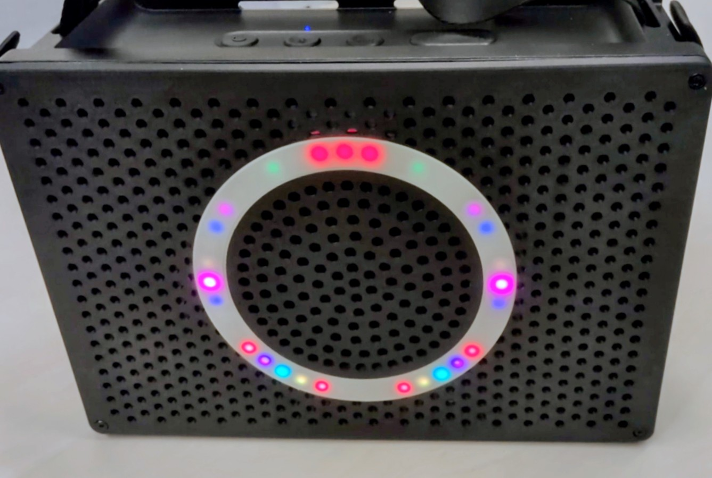

### Ring — Teufel Logo
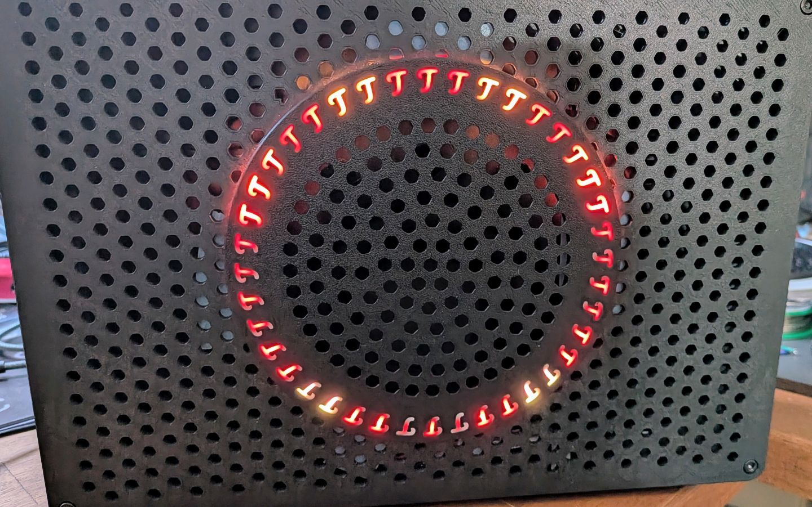

### Ring — 100 LEDs
*(photo pending)*

### Matrix — 512 LEDs (32×16)

Transparent LED matrix mounted behind the speaker grille, LEDs placed between the grille holes.

CAD drawing
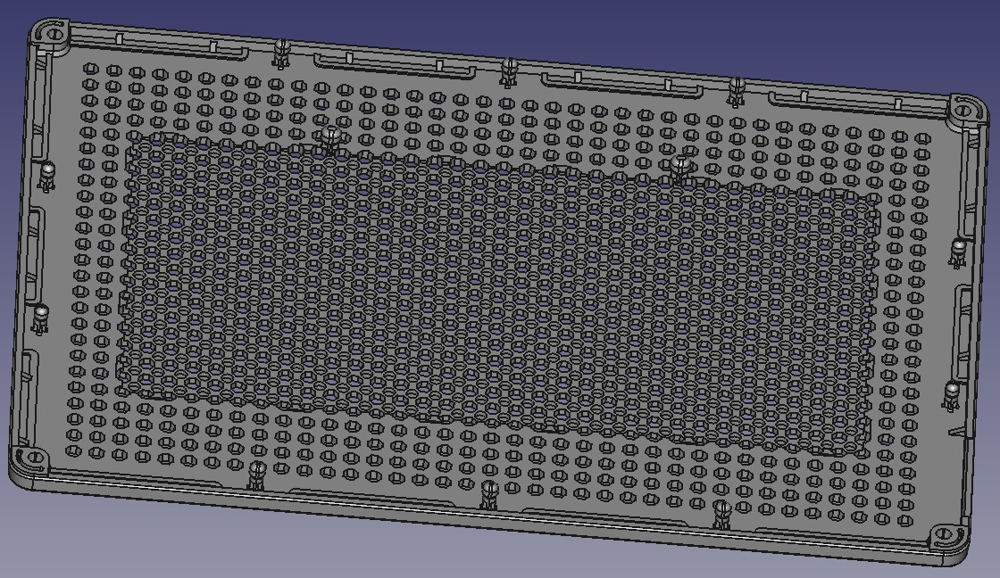

Installed Matrix PCB
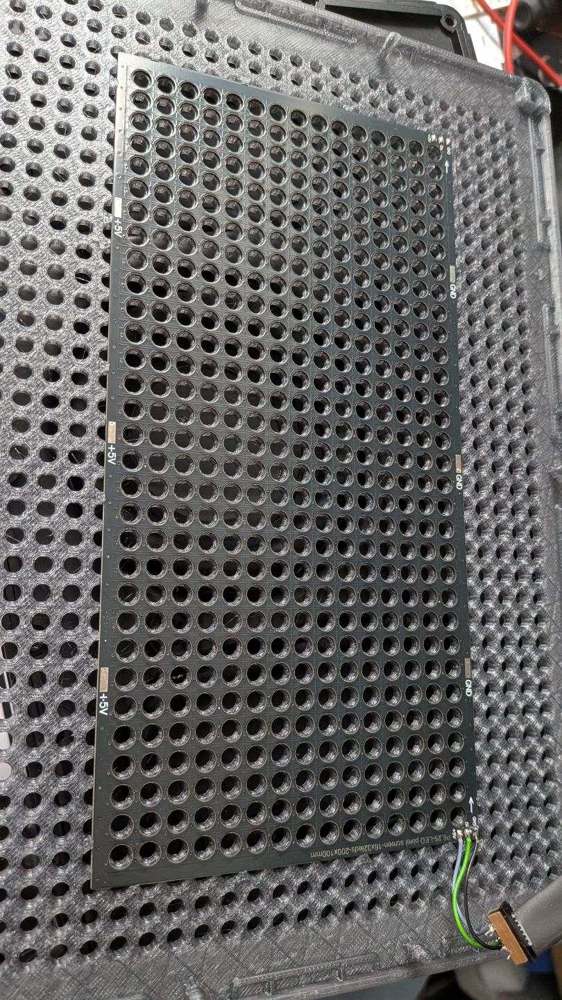

Front with the LEDs
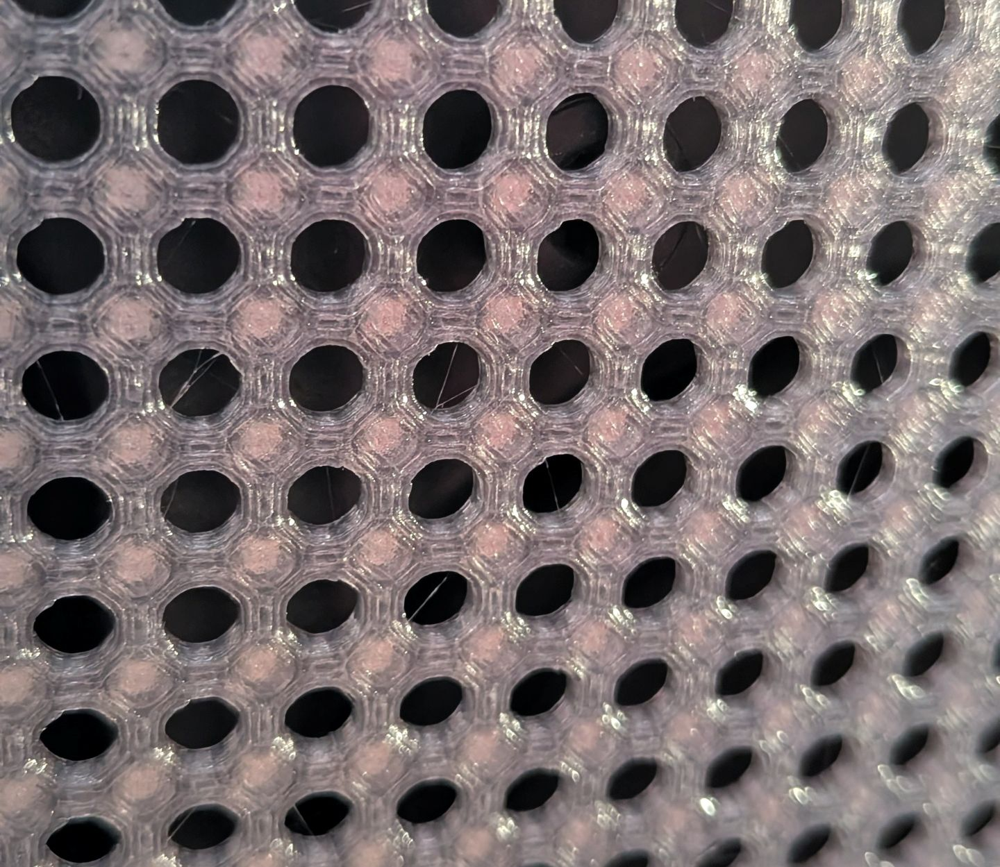


---

## Installation

### PCB

Custom PCBs handle I2S signal tapping and 5V power distribution for the ESP32-S3.

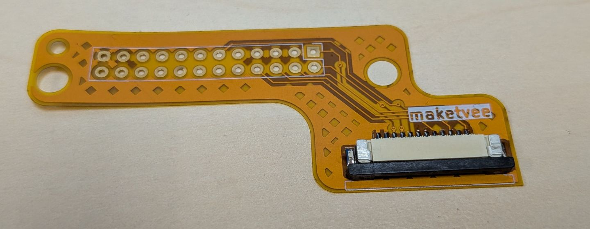
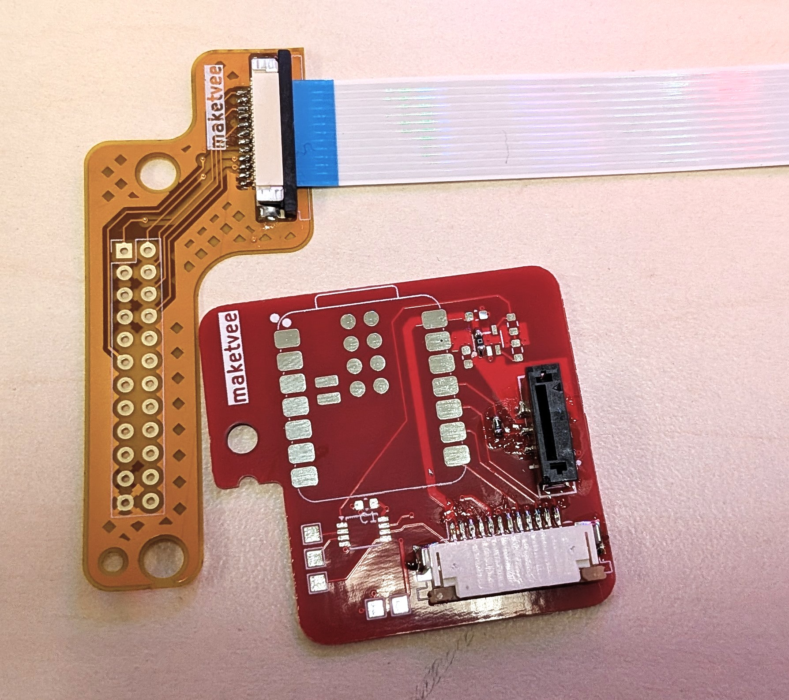

The flex PCB is dimensioned so its holes are slightly undersized relative to the mainboard connector. No soldering needed — press-fit and secure with the two existing screws.

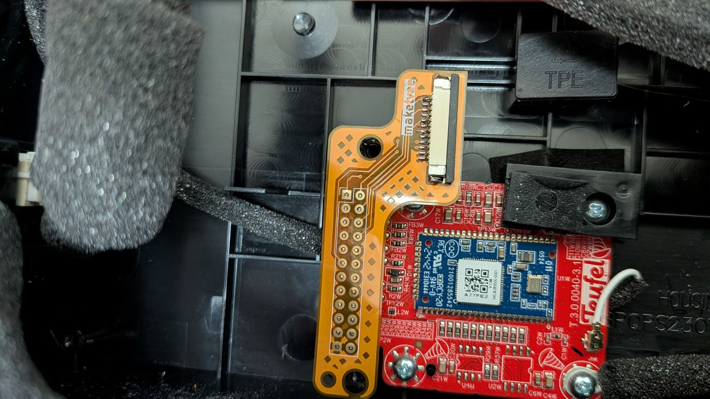

The subwoofer blocks direct routing near the connector, so signals are carried via FFC cable to the upper-right corner of the enclosure.

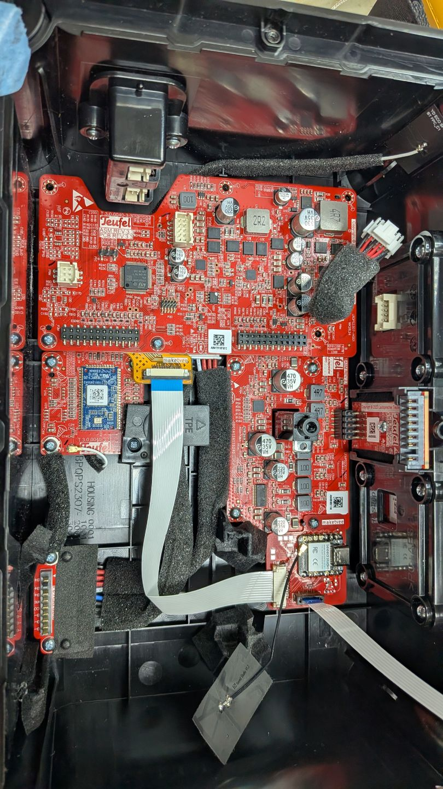

The LED harness uses a 6-wire flex cable (2× 5V, 2× GND, 2× DATA).

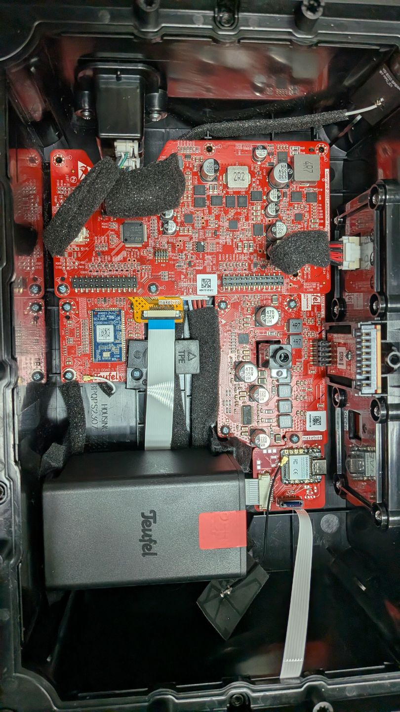

> **Future work:** Low-battery LED shutoff via STM32 I2C interface.

---

## Repository Structure

```
MYNDlights/
├── CAD/      # 3D models for front panels
└── Kicad/    # PCB schematics and layout
```

---

## License

BSD 2-Clause "Simplified" License.

## References

- [Teufel MYND hardware repo](https://github.com/teufelaudio/mynd-hardware)
